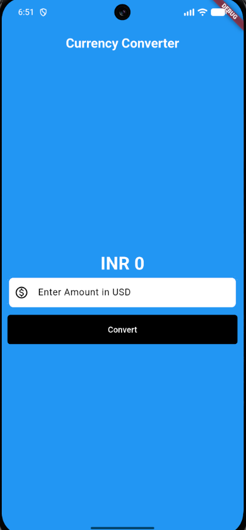

# Currency Converter

I have started learning Flutter and this is my first Flutter App.

By building this project I got to learn about:
- Setting Up a flutter Application
- Use of Virtual Emulators
- Stateful & Stateless Widgets
- States
- Text, Text Field, Buttons
- Styling of App

## UI Of Currency Converter

## Source

The Complete Dart & Flutter Developer Course | Full Tutorial For Beginners to Advanced
https://youtu.be/CzRQ9mnmh44?si=Xeba4OU5EYlsgtYP

